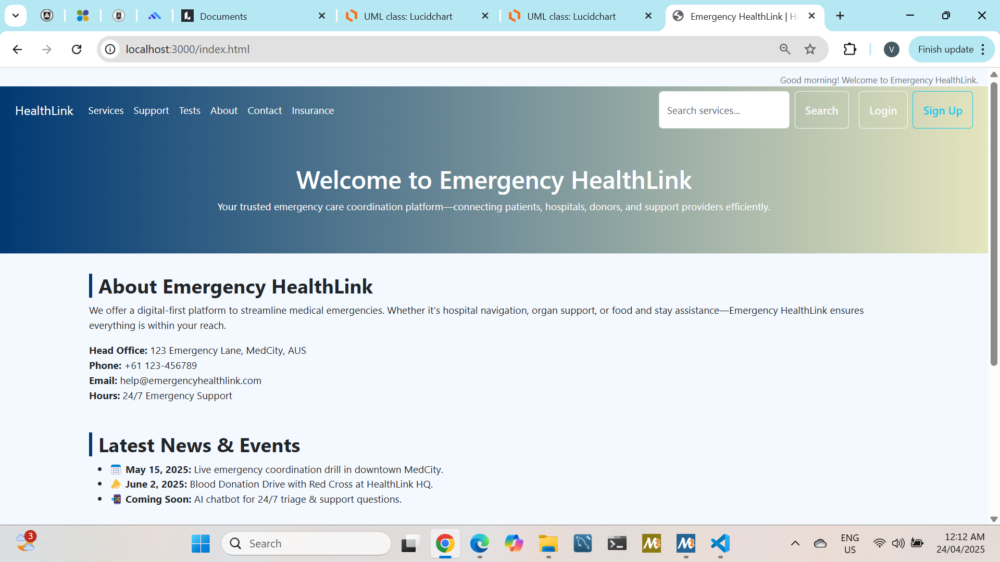
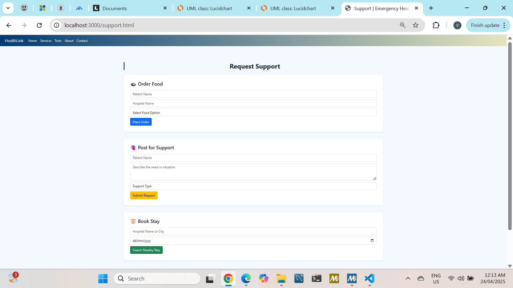

# EmergencyHealthLink (Full-Stack Web App)

EmergencyHealthLink is a web application built to support users during emergency healthcare situations by providing clear navigation, essential service pages, and structured user workflows.

## ✅ Key Features
- Multi-page emergency support website (services, blood bank, insurance, contact, login)
- Form validation using JavaScript
- Feedback submission flow using Node.js + templates
- SQLite-based persistence (database file not committed for security)

## 🧰 Tech Stack
- **Frontend:** HTML, CSS, JavaScript
- **Backend:** Node.js (Express-style server in `server.js`)
- **Templates:** EJS (`views/`)
- **Database:** SQLite (initialized via `init-db.js`)

## ▶️ How to Run Locally
1. Install dependencies:
   ```bash
   npm install

   ## 📸 Application Screenshots

### 🏠 Home Page


### 🛡️ Insurance Services


### 🧑‍💼 Support Services


### 📩 Contact & Feedback


